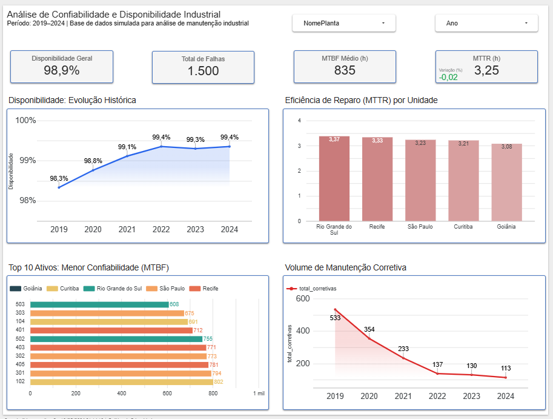
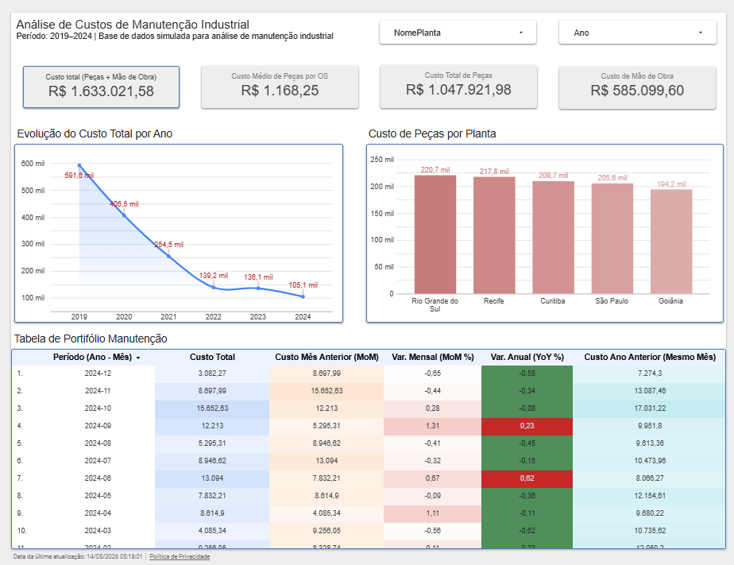

# Dashboard de Confiabilidade e Custos de Manutenção Industrial

Projeto desenvolvido com foco em análise de confiabilidade, desempenho operacional e custos de manutenção industrial utilizando SQL, BigQuery e Looker Studio.

Os dados utilizados são sintéticos e foram gerados programaticamente em Python com apoio de IA, simulando cenários reais de manutenção industrial para fins de estudo, análise e desenvolvimento de portfólio.

O dashboard foi construído com base em indicadores amplamente utilizados na engenharia de manutenção, permitindo análise temporal, identificação de ativos críticos e acompanhamento da evolução dos custos operacionais.

---

# 🚀 Tecnologias Utilizadas

- SQL
- Google BigQuery
- Looker Studio
- Modelagem de Dados
- Funções Analíticas SQL
- Window Functions

---

# 📊 Indicadores Desenvolvidos

## Confiabilidade

- MTBF (Mean Time Between Failures)
- MTTR (Mean Time To Repair)
- Disponibilidade Operacional
- Volume de Manutenções Corretivas
- Ranking de ativos críticos

---

## Custos

- Custo Total de Manutenção
- Custos de Peças
- Custos de Mão de Obra
- Crescimento MoM (Month over Month)
- Crescimento YoY (Year over Year)
- Custos por Planta

---

# 🧠 Técnicas Aplicadas

- Window Functions (`LAG`, `OVER`, `PARTITION BY`)
- Comparações temporais MoM e YoY
- Tratamento de granularidade por Ordem de Serviço
- Agregações temporais
- KPIs industriais
- Modelagem analítica para dashboards executivos
  
---

# 📂 Consultas SQL

As consultas utilizadas no projeto estão disponíveis na pasta [dashboard/sql](./dashboard/sql), incluindo cálculos de:

- MTBF
- MTTR
- Disponibilidade
- Custos temporais
- Comparações MoM e YoY
  
---

# 📂 Estrutura do Projeto


```text
maintenance-reliability-dashboard/
│
├── README.md
│
├── sql/
│   ├── confiabilidade/
│   │   ├── disponibilidade_consolidada.sql
│   │   ├── mtbf_base.sql
│   │   ├── mttr_base.sql
│   │
│   ├── custos/
│   │   ├── custos_pecas_temporal.sql
│   │   ├── custo_planta_mom_yoy.sql
│
├── images/
│   ├── dashboard_confiabilidade.png
│   ├── dashboard_custos.png
```
# 📈 Dashboard de Confiabilidade

Análise focada em desempenho operacional, disponibilidade e comportamento de falhas ao longo do tempo.



### Principais análises:
- Evolução do MTBF
- Evolução do MTTR
- Disponibilidade operacional
- Volume de corretivas
- Top 10 ativos críticos

---

# 💰 Dashboard de Custos

Análise temporal dos custos de manutenção com foco em tendência, crescimento e comparação entre plantas.



### Principais análises:
- Evolução dos custos totais
- Custos por planta
- Tendência temporal
- Comparação YoY e MoM
- Custos de peças e mão de obra

---

# ⚙️ Modelagem

As consultas SQL foram estruturadas utilizando diferentes níveis de agregação para evitar duplicidade de dados e garantir consistência nos cálculos.

Foram aplicadas estratégias de agregação por:

- MovimentoID
- Ano/Mês
- Planta
- Equipamento
- Tipo de Serviço

---

# 📌 Principais Aprendizados

- Construção de KPIs industriais
- Integração entre BigQuery e Looker Studio
- Aplicação de Window Functions
- Tratamento de granularidade
- Desenvolvimento de dashboards executivos
- Estruturação de análises temporais

---
## 📌 Observação sobre os Dados

Os dados utilizados neste projeto são sintéticos e foram gerados programaticamente em Python com apoio de IA, 
simulando cenários de manutenção industrial para fins de estudo, análise e desenvolvimento de portfólio.

---
## 🔗 Dashboard Interativo

[Acessar Dashboard](https://datastudio.google.com/reporting/a319dd0b-f9e6-40c7-a141-27c35da3735e)

# 🔗 Autor

Carlos A. R. de Mendonça

Projeto desenvolvido para fins de estudo, portfólio e evolução profissional na área de Dados e Engenharia de Manutenção.

